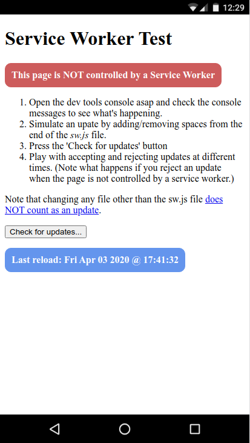
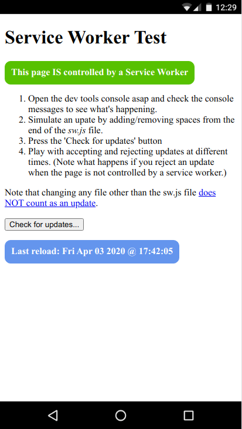

# Test Service Worker Update Flow
Project for exploring and documenting how to get the service worker update flow working perfectly.

Comments and improvements welcome.

I am in no way an expert in any of this. Just an old-fashioned java programmer trying to make sense of all this so I can 
feel confident that my apps will work well and I can stop thinking about it.

## Purpose of this project

* I want to get to the bottom of the whole service worker update flow in a simplified test space. 
* I want a piece of reusable code that solves the whole problem of handing updates to PWAs. 

## Use case

The simple use case here (which I suspect is the main one) is:

1. Publish update to PWA.
1. User is notified next time they: reload/restart the app, or press a 'check for updates' button somewhere in the UI, or the update 
is discovered because of some kind of periodic background check (I think that's it).
1. User is given the option to use the update now or later. 
   * Updates cannot be rejected indefinitely in PWA land.
   * By the time the user hears of the update it has already been installed and is waiting to become active.
1. If the user accepts the update the new service worker version is activated and, once this happens, the app reloads to get
itself in sync with the new back end.
1. If the user rejects the update they carry on using the old version of the service worker and UI until next time one of the 
three things mentioned in step 2 happens again. 
1. At this point they will get the option, again, to accept or reject the update for the time being. 
   * The fact that they may have rejected an update before should not stop them changing their mind later.
1. The only exception to this is when the app is first accessed and the first version of the service worker is installed
on the user's machine (browser). 
   * At this point the page ('client') will not be controlled, so any update will activate 
automatically. 
   * If an update is found at this point the client must be forced to catch up and become controlled by the new service worker, otherwise
we will have a v1 client being served by a v2+ service worker, and things will get increasingly out  of whack.

The code here attempt so do all of this as simply as possible. 

Have I missed anything, or misunderstood, or made it too complicated? 

## Running and playing with the app

1. Run project using `npm start` and goto http://localhost:5001 in Chrome.
1. Open the dev tools console asap and check the console messages to see what's happening.
1. Simulate an upate by adding/removing spaces to/from the end of the `sw.js` file.
1. Press the 'Check for updates' button
1. Play with accepting and rejecting updates at different times. 
   * Note what happens if you reject an update when the page is not controlled by a service worker.
   

## Background reading

* https://redfin.engineering/how-to-fix-the-refresh-button-when-using-service-workers-a8e27af6df68
* https://github.com/w3c/ServiceWorker/issues/1222
* https://github.com/w3c/ServiceWorker/issues/1247
* https://github.com/GoogleChrome/workbox/issues/2431